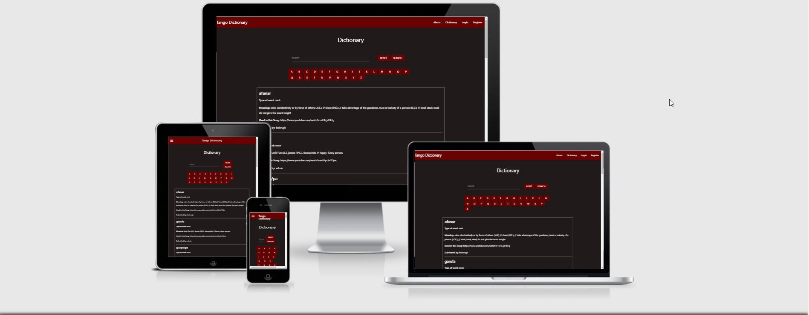
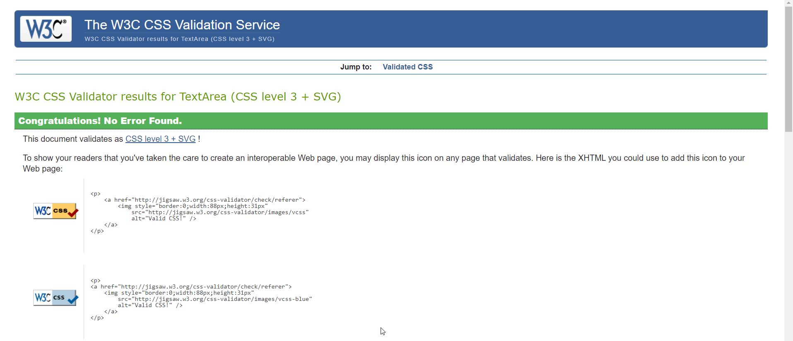
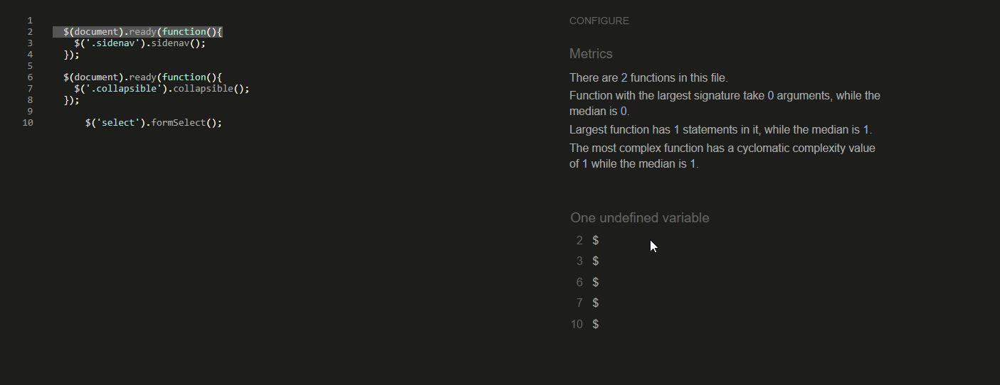

# ms3-Tango-dictionary
For my Milestone project 3 I'm creating a dictionary of Tango slang that explains the terminology of some words used on the lyrics of this music
and give some examples with songs to better understand it.



# Table of Contents

- [MS3-Tango-dictionary](#MS3-Tango-dictionary)
- [UX](#ux)
* [General](#general)
* [User Stories](#user-stories)
* [Wireframes](#wireframes)
* [Features](#features)
* [Dictionary](#dictionary)
* [Navigation](#navigation)
* [Footer](#footer)
* [About](#about)
* [Register](#register)
* [Log In](#log-in)
* [Search](#search)

- [CRUD Functionality](#crud---create--read--update-and-delete)

## General
The landing page of the website is the About page, this was done with the idea that people can read what the website is about.
first. On the Dictionary page you can find words and their meaning, I have created and index by letter for it to be easier to search
a specific word. Once the user is registered and logged in, they can add their own words, edit them or delete them if they
choose to. The "About" page explains the purpose of the website.

## User Stories

<strong>User stories: visitor</strong>
<br>
<ol>
<li>As a visitor the first thing i would like to see is the dictionary</li>
<p>Thats why the landing page is fully accessible to all visitors, no need to be registered.</p>
<li>As a visitor I want to search for specific words</li>
<p>A search bar is available on the main dictionary page to search all words.</p>
<li>As a visitor I want to easily navigate through the website</li>
<p>The main dictionary page has all teh words and you can scroll down to see all the words loaded.</p>
</ol>

<br>
<strong>User stories: user</strong>
<br>
<h3>Registered users have the same access as the visitors.</h3>
<ol>
<li>As a user I want to log in</li>
<p>The log in page is accessible in the navigation bar in the top right.</p>
<li>As a user I want to add a new word to the dictionary</li>
<p>After a user adds a word to the dictionary they will receive a message with the task succesfully completed,
then they can add another word o go back to the main screen to view their recently added word.</p>
<li>As a user I want to edit words</li>
<p>From the user dashboard, users are able to edit words which are pending approval.</p>
<li>As a user I want to log out</li>
<p>The user can log out of their account by going to the navigation bar in the top right.</p>
</ol>
<br>

### Wireframes

#### Home Page
[add word Mobile Page Wireframe](static/images/Add_word_mobile-page-001.jpg)<br>
[add word Page Wireframe](static/images/Add_word-page-001.jpg)<br>
[Dictionary](static/images/Dictionary.jpg)<br>
[Register Mobile](static/images/Register_mobile.jpg)<br>
[Login Mobile](static/images/login_mobile.jpg)<br>
[Dictionary_mobile](static/images/Dictionary_mobile.jpg)<br>

These are the original designs of the website however, there has been some modifications
along the way, and they dont look exactly the same.

## Colors

I decided to use the colors red and black with modifying the tones a little bit.
I think this colors symbolize the passion in Tango, specially the red color, but
I gave it a burgundy or "wine" kind of shade.

# Features

## Dictionary
The landing page is the dictionary. You can see all the words that have been added since it was created, on the top you can see the search bar.
and there is an index of letters to filter the search, below that you can find each word in a card separated by lines, with different categories,
"type of word", "meaning" "used in this song."


## Navigation

The navbar at the top of the page has the page title and logo aligned to the left side and the links aligned to the right side.
The links displayed on the navbar change depending whether the user is logged in or not. If a visitor is not logged in, they will see a
link for the about page, the dictionary page, the log page and the register page.

If the user is logged in, they will not see the register and log in page links anymore, instead they will see "About" "Dictionary" "Profile" "Addd word" and "Logout" they will be able to add a new word and logout.


## Footer
The footer is standard across all pages and shows the purpose for the website.


## Register

The register option gives the visitors the possiblity to register and contribute adding words to the dictionary.
The visitor needs to select a username and password. Form validation makes sure the username is not shorter than five characters or empty fields. If the username is not available, it will receive a prompt message saying "Username already exists."

## About
The about page provides information about the dictionary and the reason why it was created.

## Log In
Users who have an account can login using their username and password.
If a visitor does not have an account, there is a text below "New Here? Register Account" with a link to take them to the registration page
If the user enters their username and password they will be taken to their profile page.

## Search
On the dictionary page, users ot visitors can search for specific words located either in the word field or the meaning.


# Features left to implement

- Pagination to avoid scrolling down
- contact form
- an alert for the administrator when a word is submitted
- Option to delete a user by an admin and for users to delete their accounts.
- Ability for a user to reset their password if they forget it.
- automatically open new browser when click in on the link for the song

# CRUD

As part of the milestone project this application can perform CRUD operations.

## Create

### Add new words
All registered users are able to add new words to the dictionary. Each submission creates a new record in the database.

### Register new user
Anyone who does not have an account is able to register for an account. The register function creates a new record in the database for that user.

## Read

### Display words from Mongo DB
All users are able to read from the database.
The application pulls the words collection from the database and displays them in the dictionary.

### Search
All users are able to search for words within the dictionary. It will look for the parameters on the DB and display the results.

## Update & Delete

### Edit words
All users have the ability to delete or edit the words they submitted to the database, but only the ones they have submitted. The option to edit or
delete will be shown on each word the user has submitted previously, otherwise there wont be an option.


# Mongo DB Databse Structure
The database used for this project is MongoDB. The Database contains three collections.
- Categories
- Users
- Words

### Categories
This collection contains the types of words. Each word can be either a Noun, Verb or a Phrase.

```
_id: ObjectID
category_name: String
```

### Users
The users collection stores all the data about registered users. The strucutre of the users collection is: 

```
_id: ObjectID
user_name: String
user_password: String 
``` 

The user_password string is hashed using the Werkzeug password hash function

### words
The words collection stores all the types words, their meaning, the category they are in, who created the entry and the link. The structure is as follows:

```
_id: ObjectID
category_name: String
Word: String
Meaning: String
Link: String
Created_by: String
```


### Frameworks, Libraries & Programs Used

## Languages
* [HTML](https://en.wikipedia.org/wiki/HTML) 
* [CSS](https://en.wikipedia.org/wiki/CSS) 
* [JavaScript](https://en.wikipedia.org/wiki/JavaScript) 
* [Python](https://www.python.org/)

## Libraries

* [Materialize](https://materializecss.com/) 
* [Flask](https://flask.palletsprojects.com/en/2.0.x/)
* [Jinja](https://www.palletsprojects.com/p/jinja/)
* [Pymongo](https://pypi.org/project/pymongo/)

## Hosting

* [Heroku](https://www.heroku.com/home)

## Other Resources

1. Google Fonts

- Google Font was used to import icons

2. Github

- Github was used to store the code pushed through Gitpod

3. Gitpod

- Gitpod was the Integrated Development Environment used to develop the Website.

4. Balsamiq

- Balsamiq was used to create the wireframes during the design process.

5.  Chrome DevOps Tools

- Chrome DevOps Tools was used to check elements and help debug issues with the site layout and try different CSS styles.

6. https://pixlr.com/x/

- For editing Images

## Testing
I used W3C HTML Validator and W3C CSS Validator Services as well
as jshint to ensure there were no syntax errors in the project.
I used the "Am i responsive" website to test responsive design.
I used PEP8 for compliance for python code.

* [Am I Responsive](http://ami.responsivedesign.is/)
* [W3C Markup Validation Service](https://validator.w3.org/)
* [W3C CSS Validation Service](https://jigsaw.w3.org/css-validator/)
* [JS Hint](https://jshint.com/)
* [PEP8 Online](http://pep8online.com/)

## Results





### Testing User Stories from User Experience (UX) Section

- #### First Time and Returning Visitor

1. As a First Time Visitor, I want to easily understand the main purpose of the site, thats why the about page.
is the first one to show, It gives a brief explanation of the purpose of the site.
2. After that you can either go to the dictionary and search for words and you can add new ones

### Further Testing

- The Website was tested on Google Chrome, Internet Explorer, Microsoft Edge, Opera. All the browsers worked as expected.
- The website was viewed on different devices such as Desktops, Laptops, Android phones, iPhones, etc, and I used http://www.responsinator.com/
as well to check responsiveness. I had issues with small devices in the add word screen that was fixed with a media query.
- I asked friends and family members to review the site and give me feedback about the user experience, most of the feedback was good,
the colors where well received, the search parameters worked as expected and the sign in and register site where intuitive.
- Form validation is required to ensure the correct inputs are taken and that all fields are required.


#### Performace Test
[Desktop Lighthouse](static/images/lighthouse-desktop.jpg)


[Mobile Lighthouse](static/images/lighthouse-mobile.jpg)


# Deployment
This site is deployed on [Heroku](https://www.heroku.com/home). Heroku is an online hosting service for applications
like python. Deployment procedure below.

## Heroku
1. Navigate to the repository for this project [MS3-Tango-dictionary](https://github.com/Federvgh/MS3-Tango-Dictionary)
and click on the green button to open the menu

2. You can either download the zip file and extract it into your local directory or copy the link to the repository and clone it in the command line.

3. Create a new repository in Github and push this project into the new repository.

4. Log in to [Heroku](https://www.heroku.com/home) if you have an account or if you do not have an account, create a new account.

5. When in the Heroku dashboard, click on the "New" button and then select "Create new app"

6. On the next screen enter an app name (must be unique) and select the region closest to you.

7. In the deploy section, click on "Connect to GitHub"

8. Select your github user account and search for the repository that you want to deploy.

9. If you want, you can enable Automatic Deployment. This will build your application each time you push any changes to GitHub.

10. Navigate to settings and select "Reveal Config Vars. Here you will enter the configuration keys and values from your env.py file. They should look similar to this:
- IP: ```0.0.0.0```
- PORT: ```5000```
- MONGO_DBNAME: [name of your database]
- MONGO_URI: ```mongodb://:@ds225442.mlab.com:25442/```
- SECRET_KEY: [any string of characters. the longer the better]


11. Now go back to the "Deploy" tab and click on "Deploy Branch"

12. The website should be deployed on ```https://[your_app_name].herokuapp.com/```

## Local Deployment
1. Create a development project folder and navigate to it
``` cd /[folder path]```
2. Initialise Git
``` git init```
3. Clone the project repository into your local development folder
``` git clone https://github.com/bowets/ms3-crew-dictionary.git```
2. Install Python 3
3. Install Pip
4. Create a virtual environment for your local project
5. Install Flask
6. Install PyMongo
7. Install the packages in the requirements.txt file
8. Create an env.py file with the following parameters:
- IP: ```0.0.0.0```
- PORT: ```5000```
- MONGO_DBNAME: [name of your database]
- MONGO_URI: ```mongodb://:@ds225442.mlab.com:25442/```
- SECRET_KEY: [any string of characters. the longer the better]

The project already contains a ```.gitignore``` file which contains env.py
9. Run the project ```python app.py```


## Credits

- I took some ideas from this project https://ms3-crew-dictionary.herokuapp.com/dictionary, on how
to format the dictionary and display it.
- I took excerpts from the mini project to do the "Add word" section.
- My Mentor Antonio Rodriguez was really helpful and helped when I was stuck.
- The slack community was really helpful, I found a lot of solutions to simple issues that were already posted.
- Code institute support helped me a lot with very specific details and issues that I had.
- I took a lot of information and ideas from YouTube channels

